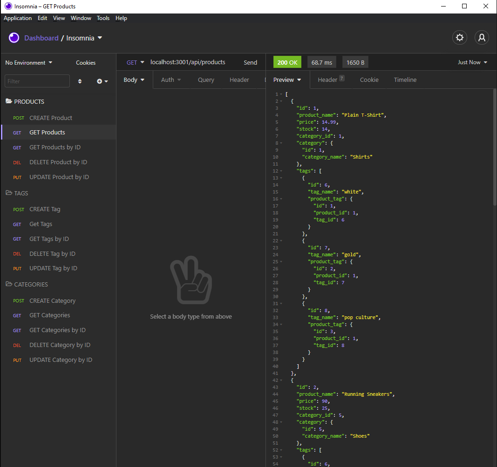
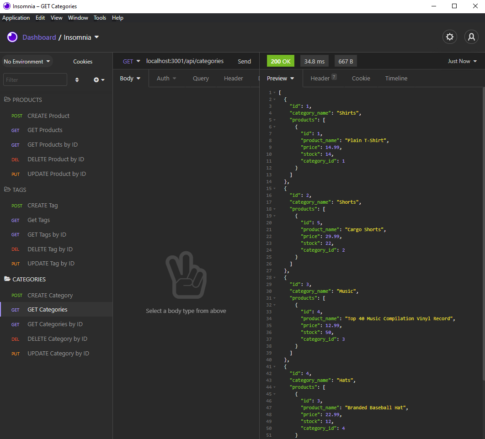
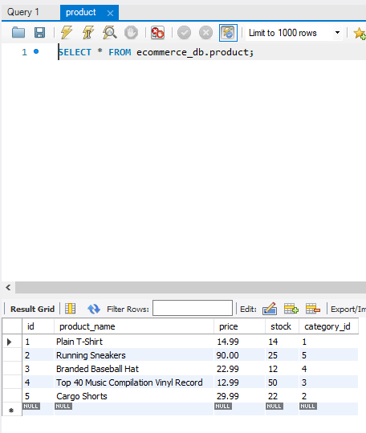

# E-Commerce Back End (Object-Relational Mapping) 

## Table of Contents
[Description](#description)  
[Key Features](#key-features)  
[Walkthrough Video](#walkthrough-video)  
[Screenshots](#screenshots)  
[Questions](#questions)  
[License](#license)

## Description
The focus of this homework assignment for the University of Toronto SCS Coding Boot Camp was to build the back end for an e-commerce site by modifying starter code. Technologies used included MySQL, MySQL2, Sequelize, Express, Insomnia and dotenv package.

## Key Features
- Application uses the [dotenv package](https://www.npmjs.com/package/dotenv) that allows the database name, MySQL username and MySQL password to be saved in an environment variable file
- Application uses the [mysql package](https://www.npmjs.com/package/mysql) and [Sequelize](https://npmjs.com/package/sequelize) to connect to the MySQL database and perform queries
- Schema and seed commands will create a development database which is seeded with test data (provided)
- API GET routes for categories, products, or tags will result in the data being displayed in formatted JSON
- API POST, PUT, and DELETE routes will create, update, and delete data in the database

## Walkthrough Video
The following video demonstrates the application's functionality.
- [Video](https://drive.google.com/file/d/1iZB4paB65z0jIRSfHUhNuqvarquSTXh9/view?usp=sharing)

## Screenshots
The images below show aspects of the application including output received from Insomnia when running different routes and an image of one of the mySQL tables.

## Questions
Please contact me (see my profile), I'm happy to answer any questions.

## License
This product is under the MIT License.
